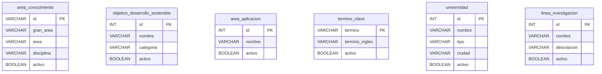

# Modelo de datos — v1: Investigación (MariaDB)

## 1. Las tablas

La v1 trabaja con las seis tablas del módulo de Investigación que no tienen
claves foráneas.

### 1.1 `area_conocimiento`

| Columna | Tipo | |
|---|---|---|
| `id` | `VARCHAR(6)` | **Llave primaria** |
| `gran_area` | `VARCHAR(60)` | No nulo |
| `area` | `VARCHAR(60)` | No nulo |
| `disciplina` | `VARCHAR(150)` | No nulo |
| `activo` | `BOOLEAN` (alias de `TINYINT(1)`) | No nulo, por defecto `TRUE` — **agregada**, ver §3 |

### 1.2 `objetivo_desarrollo_sostenible`

| Columna | Tipo | |
|---|---|---|
| `id` | `INT` | **Llave primaria** |
| `nombre` | `VARCHAR(60)` | No nulo |
| `categoria` | `VARCHAR(45)` | No nulo |
| `activo` | `BOOLEAN` (alias de `TINYINT(1)`) | No nulo, por defecto `TRUE` — **agregada**, ver §3 |

### 1.3 `area_aplicacion`

| Columna | Tipo | |
|---|---|---|
| `id` | `INT` | **Llave primaria** |
| `nombre` | `VARCHAR(150)` | No nulo |
| `activo` | `BOOLEAN` (alias de `TINYINT(1)`) | No nulo, por defecto `TRUE` — **agregada**, ver §3 |

### 1.4 `termino_clave`

| Columna | Tipo | |
|---|---|---|
| `termino` | `VARCHAR(30)` | **Llave primaria** |
| `termino_ingles` | `VARCHAR(30)` | Puede ser nulo |
| `activo` | `BOOLEAN` (alias de `TINYINT(1)`) | No nulo, por defecto `TRUE` — **agregada**, ver §3 |

### 1.5 `universidad`

| Columna | Tipo | |
|---|---|---|
| `id` | `INT` | **Llave primaria** |
| `nombre` | `VARCHAR(60)` | No nulo |
| `tipo` | `VARCHAR(45)` | No nulo |
| `ciudad` | `VARCHAR(45)` | No nulo |
| `activo` | `BOOLEAN` (alias de `TINYINT(1)`) | No nulo, por defecto `TRUE` — **agregada**, ver §3 |

### 1.6 `linea_investigacion`

| Columna | Tipo | |
|---|---|---|
| `id` | `INT AUTO_INCREMENT` | **Llave primaria**, generada por MariaDB |
| `nombre` | `VARCHAR(45)` | No nulo |
| `descripcion` | `VARCHAR(256)` | No nulo |
| `activo` | `BOOLEAN` (alias de `TINYINT(1)`) | No nulo, por defecto `TRUE` — **agregada**, ver §3 |

Las seis tablas son independientes en esta versión: ninguna tiene una clave
foránea hacia otra tabla.



## 2. Lo que el esquema dado tiene y no se rediseña

El esquema completo del módulo es un artefacto dado. La v1 solamente trabaja
sobre las seis tablas sin claves foráneas.

Las tablas correspondientes a versiones posteriores permanecen en
`db/init.sql`, pero la API de la v1 no las consulta ni las modifica.

La estructura existente se conserva tal como está definida en el script.
No se cambian nombres de tablas, columnas, llaves, relaciones o tipos por
preferencia de diseño.

Solamente se reconocen los ajustes mínimos que ya están documentados en la
cabecera de `db/init.sql` y los que sean estrictamente necesarios para cumplir
las reglas obligatorias del proyecto.

Esto mantiene la regla de no anticipar versiones: que una tabla exista en la
base no significa que la API de la v1 tenga permiso para utilizarla.


## 3. Cambios ya presentes en `db/init.sql` respecto al script del curso

El `db/init.sql` utilizado por el proyecto se declara como derivado del script
entregado por el curso. Su propia cabecera documenta cinco cambios ya
incorporados.

| | Cambio presente | Motivo documentado en `db/init.sql` |
|---|---|---|
| C1 | `area_conocimiento.id`: `INT` → `VARCHAR(6)` | El catálogo utiliza códigos alfanuméricos como `1A01` |
| C2 | `area_conocimiento.disciplina` → `VARCHAR(150)` | El catálogo contiene valores que superan el tamaño original |
| C3 | `area_aplicacion.nombre` → `VARCHAR(150)` | Existen nombres del catálogo que superan el tamaño original |
| C4 | Se agrega `activo BOOLEAN NOT NULL DEFAULT TRUE` | El proyecto exige borrado lógico |
| C5 | `'Cienias Naturales'` → `'Ciencias Naturales'` | Corrección de una errata de digitación en los datos de referencia |

Estos cambios se documentan porque ya forman parte del `init.sql` utilizado
por el proyecto. Esta sección no autoriza cambios adicionales sobre el
esquema.

C1, C2 y C3 permiten que los datos de referencia existentes puedan
representarse correctamente. C4 responde directamente a la regla de borrado
lógico del proyecto.

C5 es una corrección de datos ya presente en el script y no representa un
rediseño de la estructura de la base.

El `init.sql` actual aplica `activo` a las 16 tablas del módulo. La v1 solamente
utiliza esta columna en los seis recursos incluidos en su alcance.

Que `activo` exista también en tablas de versiones posteriores no habilita
esas tablas ni amplía el alcance de la v1.

El script tampoco contiene `CREATE DATABASE` ni `USE`. La base es creada por
el entorno de ejecución y `init.sql` se ejecuta dentro de ella.


## 4. `activo` no es un campo de la ficha

`activo` no es un dato que quien utiliza la API pueda crear o modificar
directamente.

No se recibe en POST, PUT ni PATCH y no forma parte de la lista de campos
editables de los controladores.

Se modifica solamente mediante la operación DELETE del repositorio:

```sql
UPDATE ...
SET activo = FALSE
WHERE ...
  AND activo = TRUE
```

Los SELECT normales también incluyen activo = TRUE.

Si activo se aceptara como un campo común, retirar o reactivar una ficha
dejaría de ser una operación controlada y pasaría a ser un valor que cualquier
petición podría modificar.

Para la API, una fila retirada se comporta como un recurso no disponible,
aunque físicamente continúe almacenada en MariaDB.


## 5. Las semillas

Los datos de referencia definidos para la v1 y el estado actual de
`db/init.sql` son:

| Tabla | Datos de referencia del módulo | Estado actual de `db/init.sql` |
|---|---:|---|
| `area_conocimiento` | 218 | 218 cargados |
| `objetivo_desarrollo_sostenible` | 17 | 17 cargados |
| `area_aplicacion` | 21 | 21 cargados |
| `universidad` | 6 | No están cargados actualmente |
| `termino_clave` | Sin cantidad definida | Sin semillas |
| `linea_investigacion` | Sin cantidad definida | Sin semillas |

`area_conocimiento`, `objetivo_desarrollo_sostenible` y `area_aplicacion`
ya tienen sus INSERT en `db/init.sql`.

El documento del módulo indica que `universidad` tiene 6 registros provenientes
de los datos de referencia. Sin embargo, el `db/init.sql` actual no contiene
esos INSERT.

Antes de modificar el script se debe comprobar la fuente de datos entregada
para el módulo. Si allí se encuentran esos 6 registros, su incorporación al
`init.sql` será un ajuste necesario para cargar el catálogo oficial de la v1,
no un rediseño de la base.

No se inventan registros para completar esa cantidad.

Para `termino_clave` y `linea_investigacion` el módulo no define una cantidad
inicial de registros, por lo que pueden comenzar sin semillas.


## 6. Quién escribe qué

| Dato | Dueño | La API… |
|---|---|---|
| `area_conocimiento.id` | Quien crea el registro | Lo escribe **solo** en POST. PUT y PATCH no cambian la llave |
| `objetivo_desarrollo_sostenible.id` | Quien crea el registro | Lo escribe **solo** en POST. PUT y PATCH no cambian la llave |
| `area_aplicacion.id` | Quien crea el registro | Lo escribe **solo** en POST. PUT y PATCH no cambian la llave |
| `termino_clave.termino` | Quien crea el registro | Lo escribe **solo** en POST. Es la llave de la fila |
| `universidad.id` | Quien crea el registro | Lo escribe **solo** en POST. PUT y PATCH no cambian la llave |
| `linea_investigacion.id` | MariaDB | Lo genera mediante `AUTO_INCREMENT`; el POST no lo exige |
| Los demás campos de cada ficha | La API | Los escribe en POST, PUT y PATCH según las reglas de cada operación |
| `activo` | La API, pero **solo** mediante DELETE | **Tiene prohibido** recibirlo como campo editable |
| Las tablas de versiones posteriores | Nadie, en la v1 | La API de esta versión no las nombra ni las modifica |